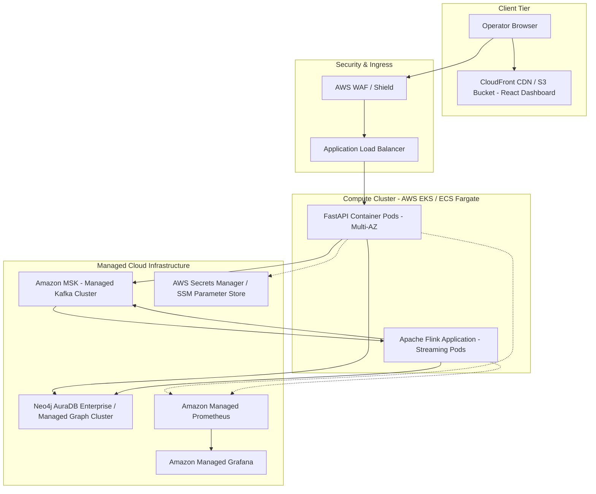

# ChronosMesh Stage 5 — Cloud Deployment Architecture & Readiness Plan

## 1. Overview & Cloud Target Architecture
This document details the production cloud deployment architecture plan for ChronosMesh on Amazon Web Services (AWS) / Google Cloud Platform (GCP).

> [!NOTE]
> This document specifies the enterprise cloud readiness blueprint and deployment configurations. Local verification runs on Docker and local execution environments.



---

## 2. Infrastructure Service Mapping

| Component | Local / Development Environment | AWS Production Equivalent | GCP Production Equivalent |
| :--- | :--- | :--- | :--- |
| **Event Streaming** | Confluent Kafka Docker | **Amazon MSK** (Multi-AZ) | **Google Cloud Pub/Sub** or Confluent Cloud |
| **Stream Processor**| Apache Flink Docker | **Amazon Managed Service for Flink** (KDA) | **Cloud Dataflow** / Managed Flink on GKE |
| **Graph Store** | Neo4j Community Docker | **Neo4j AuraDB Enterprise** | **Neo4j AuraDB on GCP Marketplace** |
| **REST / SSE API** | Uvicorn ASGI Server | **AWS ECS Fargate / EKS** | **Google Cloud Run / GKE** |
| **Frontend UI** | Vite Dev Server / Nginx | **AWS S3 + CloudFront CDN** | **Google Cloud Storage + Cloud CDN** |
| **Telemetry** | Local Prometheus & Grafana | **Amazon Managed Prometheus + Grafana** | **Google Cloud Monitoring + Managed Grafana** |
| **Secrets** | Local `.env` (gitignored) | **AWS Secrets Manager** | **GCP Secret Manager** |

---

## 3. Networking, Security Groups & Ingress Control

### 3.1 Network Topology:
- **VPC Subnets:**
  - `Public Subnets (x2)`: Internet-facing ALB and CloudFront distribution.
  - `Private App Subnets (x2)`: ECS/EKS tasks running FastAPI backend and Flink workers. No direct public IP.
  - `Private Data Subnets (x2)`: MSK broker nodes and database endpoints with VPC peering to Neo4j Aura.

### 3.2 Security Group Rules:
- **ALB Security Group:** Inbound HTTPS (port 443) from `0.0.0.0/0`. Outbound to ECS Tasks on port 8000.
- **FastAPI ECS Security Group:** Inbound port 8000 only from ALB SG. Outbound port 9092/29092 to MSK SG and port 7687 to Neo4j Aura.
- **MSK Broker Security Group:** Inbound TLS port 9094 only from FastAPI SG and Flink SG.
- **Prometheus Scraper:** Scrapes metrics internally over VPC via private IP addresses.

---

## 4. Autoscaling & High Availability

### 4.1 FastAPI Backend (Stateless):
- **Horizontal Pod Autoscaler (HPA):** Scales between 2 and 10 replicas based on:
  - Average CPU utilization $> 70\%$
  - Average HTTP request count per target $> 1,000\text{ req/min}$
- **Zero-Downtime Rolling Updates:** Maximum surge 25%, maximum unavailable 0%.

### 4.2 Flink Streaming Workers:
- **Adaptive Task Slots:** Scale based on Kafka partition lag metrics exposed to Prometheus.
- **Savepointing:** Hourly automated checkpoints to Amazon S3 for state durability.

---

## 5. Cost Considerations & Sizing Estimates

| Service | Tier / Instance Size | Monthly Cost Estimate (US-East) |
| :--- | :--- | :--- |
| **Amazon MSK** | 3 x `kafka.m5.large` (3 AZs) | ~$450 |
| **AWS ECS Fargate (API)** | 2 tasks (1 vCPU, 2GB RAM) | ~$75 |
| **Managed Flink (KDA)** | 2 KPUs (Kinesis Processing Units) | ~$160 |
| **Neo4j AuraDB Enterprise** | 8GB RAM Instance | ~$400 |
| **S3 + CloudFront (Frontend)**| 100 GB transfer | ~$15 |
| **Prometheus / Grafana** | Managed ingestion (~5M metrics) | ~$25 |
| **Total Estimated Run-Rate** | | **~$1,125 / month** |

*Note: For lower-tier staging environments, single-node Neo4j and self-hosted Kafka on EC2 reduces cost to <$150/month.*

---

## 6. Step-by-Step Deployment & Rollback Strategy

### Step 1: Deploy Data Layer
1. Provision Neo4j AuraDB instance; execute schema initialization (`chronosmesh/storage/neo4j_store.py`).
2. Provision MSK cluster; create topics `events.raw` and `events.causal` with 6 partitions each.

### Step 2: Build & Push Images
```bash
# Build production Docker image
docker build -f api/Dockerfile -t <ECR_REPO_URL>/chronosmesh-api:v1.0.0 .
aws ecr get-login-password | docker login --username AWS --password-stdin <ECR_REPO_URL>
docker push <ECR_REPO_URL>/chronosmesh-api:v1.0.0
```

### Step 3: Deploy Frontend to S3/CloudFront
```bash
cd frontend
npm ci && npm run build
aws s3 sync dist/ s3://<FRONTEND_S3_BUCKET>/ --delete
aws cloudfront create-invalidation --distribution-id <CF_DIST_ID> --paths "/*"
```

### Step 4: Blue/Green Rollback Strategy
- CloudFormation / Terraform templates version all infrastructure.
- In case of deployment regression:
  1. Switch ALB traffic target group back to the previous Blue task set (`< 30 seconds`).
  2. Invalidate CloudFront cache to point to previous S3 version directory.
