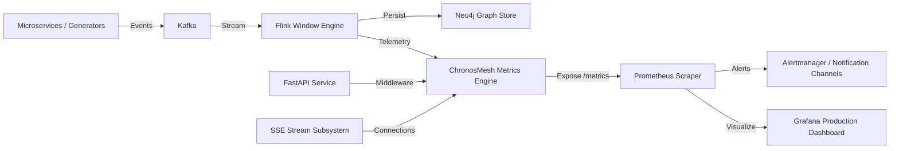

# ChronosMesh Stage 5 — Observability, Metrics & Alerting Architecture

## 1. Overview & Architecture
ChronosMesh observability provides real-time telemetry across distributed event ingestion, Flink stream processing, graph persistence, and API delivery.



---

## 2. Core Prometheus Metrics Specification

All metrics are exposed at `GET /metrics` and `GET /api/metrics` via `prometheus_client`.

| Metric Name | Type | Description | Labels |
| :--- | :--- | :--- | :--- |
| `chronosmesh_events_received_total` | Counter | Cumulative distributed events ingested by system | `region`, `service_id` |
| `chronosmesh_events_processed_total` | Counter | Events successfully processed by causal engine | `pipeline_stage` |
| `chronosmesh_events_failed_total` | Counter | Events failing validation, parsing or ordering | `reason` |
| `chronosmesh_api_requests_total` | Counter | HTTP requests served by FastAPI | `method`, `endpoint`, `status` |
| `chronosmesh_api_request_duration_seconds` | Histogram | Latency distribution of REST endpoints | `endpoint` |
| `chronosmesh_sse_connections` | Gauge | Active Server-Sent Events dashboard clients | none |
| `chronosmesh_anomalies_total` | Counter | Causal anomalies, cycle violations or clock skew detected | `anomaly_type` |
| `chronosmesh_kafka_messages_produced_total`| Counter | Total events pushed to Kafka topics | `topic` |
| `chronosmesh_kafka_messages_consumed_total`| Counter | Total events consumed from Kafka topics | `consumer_group` |
| `chronosmesh_neo4j_operations_total` | Counter | Read/write/traversal operations executed in Neo4j | `operation_type` |
| `chronosmesh_causal_processing_duration_seconds` | Histogram | Execution time for DAG construction & reduction | `algorithm` |

---

## 3. Grafana Production Dashboard

The pre-configured Grafana dashboard is located in [`observability/grafana/dashboards/chronosmesh.json`](file:///c:/Users/gurus/OneDrive/Desktop/FOURTH%20YEAR%20SEMESTER-7%20PPTS/Cloud%20Computing%20PE-5/Project-Case-Study/ChronosMesh/observability/grafana/dashboards/chronosmesh.json).

### Dashboard Panels & Interpretation
1. **System Health & Core Counters:**
   - **Ingested vs Processed:** Visual verification that processed equals received (zero event loss).
   - **Active SSE Clients:** Tracks live connected React dashboard operators.
   - **Causal Anomalies:** Monitors abnormal clock jumps, causal inversions, or concurrent conflict storms.
2. **Pipeline Rates & Throughput:**
   - Evaluates ingestion velocity (ev/s) vs stream processing rate. Divergence indicates buffering backpressure.
3. **Kafka Lag & Throughput:**
   - Compares producer vs consumer rates. Lag growth triggers proactive consumer autoscaling alerts.
4. **API Latency & Causal Engine Processing Time:**
   - Quantiles ($p50$, $p95$, $p99$) ensuring responsiveness for deep ancestor/descendant graph queries.

---

## 4. Production Alerting Rules & Threshold Rationale

Defined in [`observability/alert_rules.yml`](file:///c:/Users/gurus/OneDrive/Desktop/FOURTH%20YEAR%20SEMESTER-7%20PPTS/Cloud%20Computing%20PE-5/Project-Case-Study/ChronosMesh/observability/alert_rules.yml):

| Alert Name | Condition | Evaluation Window | Severity | Rationale |
| :--- | :--- | :--- | :--- | :--- |
| `ChronosMeshApiHighLatency` | $p95 > 500\text{ ms}$ | 1 minute | `warning` | UI queries should complete in $<200\text{ ms}$; $>500\text{ ms}$ degrades operator experience. |
| `ChronosMeshEventProcessingFailures` | $> 5\text{ failures}$ | 5 minutes | `critical` | Indicates corrupt event payloads or schema contract violations. |
| `ChronosMeshHighAnomalyRate` | $> 20\text{ anomalies}$ | 5 minutes | `warning` | Detects widespread clock drift (NTP desynchronization) or network partition. |
| `ChronosMeshNeo4jUnavailable` | $\text{ops} == 0$ | 5 minutes | `critical` | Graph store failure halts persistent DAG traversal and query features. |
| `ChronosMeshKafkaConsumerLag` | $\text{Lag} > 500\text{ msgs}$ | 3 minutes | `warning` | Downstream Flink pipeline cannot keep up with burst event volume. |
| `ChronosMeshSseClientDisconnectSpike`| Rate $< -10$ clients | 1 minute | `warning` | Indicates potential proxy termination or network outage affecting dashboard users. |

---

## 5. Structured JSON Logging

ChronosMesh implements structured, machine-parsable JSON logging in [`api/logger.py`](file:///c:/Users/gurus/OneDrive/Desktop/FOURTH%20YEAR%20SEMESTER-7%20PPTS/Cloud%20Computing%20PE-5/Project-Case-Study/ChronosMesh/api/logger.py).

### Schema Standard:
```json
{
  "timestamp": "2026-09-28T10:35:12.184Z",
  "level": "INFO",
  "service": "chronosmesh-api",
  "trace_id": "T-1001",
  "event_id": "E-102",
  "event_type": "ORDER_CREATED",
  "region": "aws-mumbai",
  "processing_time_ms": 1.45,
  "message": "Causal event ingested and verified"
}
```

### Security Masking Policy:
The JSON formatter automatically masks fields matching `password`, `secret`, `token`, `api_key`, `credential`, and `jwt`, preventing accidental leakage in ELK, Loki, or Datadog log aggregators.
