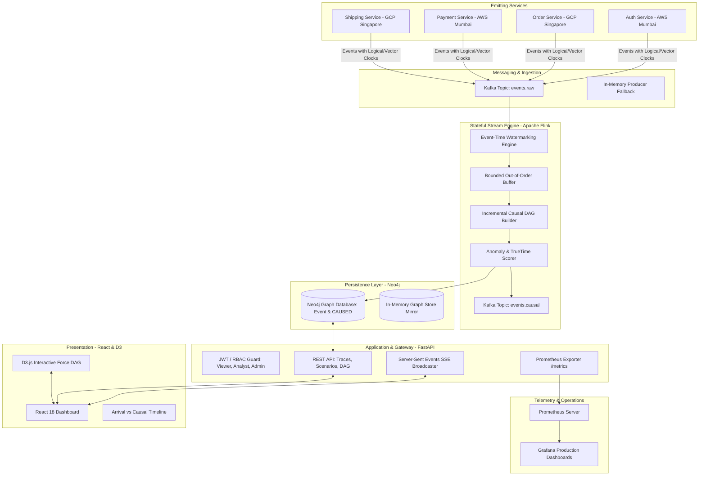

# ChronosMesh — End-to-End System Architecture

## 1. System Overview
ChronosMesh is a distributed causal tracing, anomaly detection, and reconstruction engine designed for multi-region microservices operating under network delay, physical clock skew, and out-of-order event delivery.

---

## 2. Architectural Layers

### 2.1 Logical Clock Foundations (Stage 1)
- **Lamport Clocks:** Scalar logical clock guaranteeing strict partial ordering ($a \to b \implies C(a) < C(b)$).
- **Vector Clocks:** Dimensional clock capturing causal dependency across independent microservices and detecting concurrent operations ($u \parallel v$).
- **Hybrid Logical Clocks (HLC):** Combines physical wall-clock time with logical counters, ensuring monotonic progression and TrueTime-bounded error margins.

### 2.2 Streaming & Causal Engine (Stage 4 & 5)
- **Bounded Out-of-Order Watermarking:** Flink tumbling windows with delay slack allow out-of-order arrivals to be sorted before DAG construction.
- **Incremental Transitive Reduction:** Localized neighbor pruning reduces per-event complexity from $O(N^3)$ to $O(k \cdot |V|)$, eliminating transitive bypass edges.

### 2.3 Persistence & Resiliency (Stage 2 & 5)
- **Neo4j Property Graph:** Stores events as `:Event` nodes and causal relationships as `[:CAUSED {confidence, explicit}]` edges.
- **Dual-Mode Resiliency:** When external Kafka or Neo4j brokers are unreachable, the system automatically activates in-memory fallbacks without dropping events or crashing.

### 2.4 Security & Observability (Stage 5)
- **Role-Based Access Control:** Strict JWT token enforcement across `ROLE_VIEWER`, `ROLE_ANALYST`, and `ROLE_ADMIN`.
- **Telemetry:** Built-in Prometheus `/metrics` scraper, pre-configured Grafana dashboard, alert rules, and structured JSON logging with secret sanitization.
